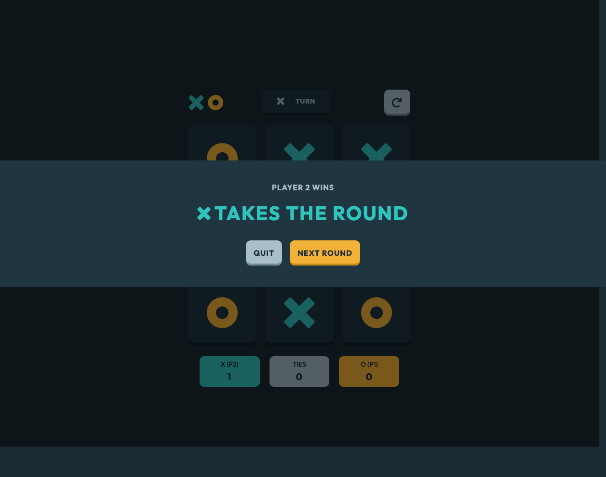

# Frontend Mentor - Tic Tac Toe solution

This is a solution to the [Tic Tac Toe challenge on Frontend Mentor](https://www.frontendmentor.io/challenges/tic-tac-toe-game-Re7ZF_E2v). Frontend Mentor challenges help you improve your coding skills by building realistic projects.

## Table of contents

- [Overview](#overview)
  - [The challenge](#the-challenge)
  - [Screenshot](#screenshot)
  - [Links](#links)
- [My process](#my-process)
  - [Built with](#built-with)
  - [What I learned](#what-i-learned)
  - [Continued development](#continued-development)
  - [Useful resources](#useful-resources)
- [Author](#author)
- [Acknowledgments](#acknowledgments)

## Overview

### The challenge

Users should be able to:

- View the optimal layout for the game depending on their device's screen size
- See hover states for all interactive elements on the page
- Play the game either solo vs the computer or multiplayer against another person
- **Bonus 1**: Save the game state in the browser so that it’s preserved if the player refreshes their browser
- **Bonus 2**: Instead of having the computer randomly make their moves, try making it clever so it’s proactive in blocking your moves and trying to win

### Screenshot

### Links

- [GitHub Repository](https://github.com/clementstorne/FrontendMentor-tic-tac-toe-game)
- [Live Demo](https://clementstorne-tic-tac-toe-game.netlify.app/)

## My process

### Built with

- React
- Tailwind CSS
- Redux

### What I learned

One of the key learnings from this project was the implementation of the Minimax algorithm for the computer's moves in the Tic Tac Toe game. The Minimax algorithm is a decision-making algorithm used in two-player games, and it helped me create a more strategic and competitive computer opponent.

The Minimax algorithm works by recursively evaluating possible moves and their outcomes, assigning a score to each move based on the assumption that both players will make optimal moves. This allows the computer to make intelligent decisions and choose the move that minimizes the maximum possible loss (hence the name Minimax).

Implementing the Minimax algorithm in the context of a Tic Tac Toe game provided insights into recursive algorithms, game tree structures, and how to apply strategic thinking to artificial intelligence in gaming scenarios. This experience was valuable in enhancing my understanding of algorithmic decision-making processes.

### Continued development

I plan to continue focusing on refining my React and Redux skills, exploring more advanced state management techniques, and further improving my responsiveness implementation.

### Useful resources

- [React Documentation](https://reactjs.org/docs/getting-started.html) - The official documentation is always a valuable resource for learning and reference.
- [Tailwind CSS Documentation](https://tailwindcss.com/docs) - The Tailwind CSS documentation provides comprehensive guidance on using the utility-first CSS framework.

## Author

- Github - [Clément Storne](https://github.com/clementstorne)
- Frontend Mentor - [@clementstorne](https://www.frontendmentor.io/profile/clementstorne)
- Twitter - [@clementstorne](https://twitter.com/clementstorne)

## Acknowledgments

I want to express my gratitude to the Frontend Mentor community for providing challenging projects and valuable feedback. Special thanks to anyone who contributed inspiration or guidance that helped me in completing this project.
